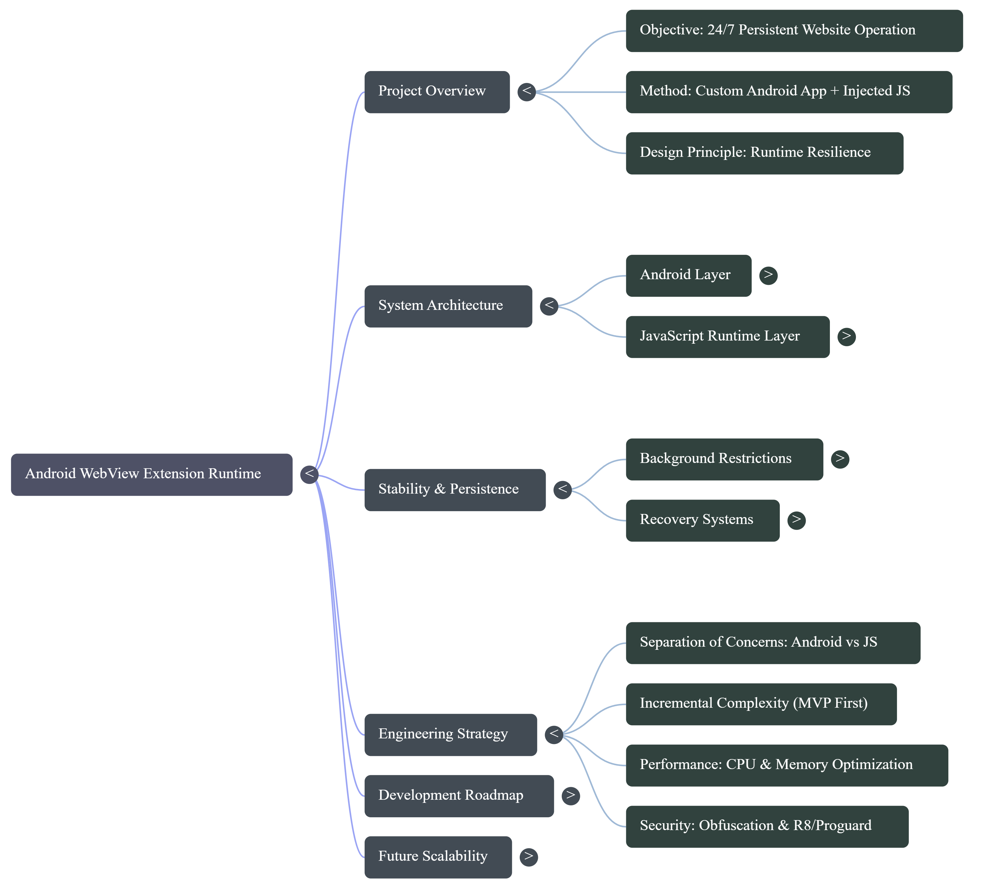

# Phase 1 - MVP Runtime Foundation

## Aim
Ship a stable MVP runtime that keeps the target site running 24/7 with injected JS and clear Android/JS separation.

## Objectives
- Create the Android layer (runtime controller, WebView manager, foreground service stub).
- Build the JS runtime layer (injection, heartbeat, basic hooks).
- Validate the Android <-> JS bridge and messaging contract.
- Handle background restrictions with a minimal persistence strategy.
- Add basic recovery (reload, reinject, network reconnect).

## Deliverables
- WebView lifecycle manager that can safely recreate the WebView.
- JS runtime bundle in assets (inject, runtime, hooks).
- Bridge interface for commands, logs, and heartbeat.
- Minimal watchdog loop with reload + reinject.
- Baseline performance guardrails (no tight loops, scoped observers).

## Success Criteria
- Target site loads consistently and sessions persist.
- JS runtime survives reloads and navigation.
- Heartbeat and commands pass both directions.
- App survives backgrounding for short periods without manual recovery.

## Status
Planned (pending Phase 0 validation).
