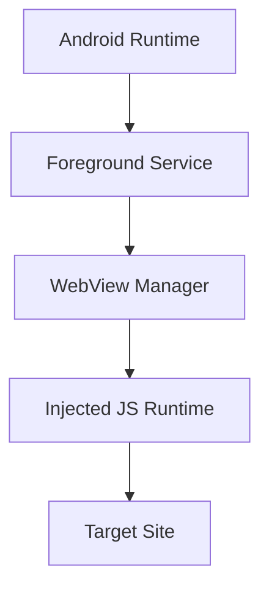

# Crusty

	

> Persistent Android WebView runtime with an injected JavaScript layer to deliver extension-like behavior for a single target site.

**Maintainer:** [github.com/cursorhigh](https://github.com/cursorhigh)

## Overview
Crusty is a production-minded Android runtime that keeps a single website running continuously and injects a JS runtime for automation, hooks, and UI overlays.

## Key capabilities
- Long-lived WebView runtime with safe recreate flow.
- Injected JS runtime for DOM hooks, automation, and event handling.
- Android <-> JS bridge for commands, logs, and heartbeat.
- Self-recovery for common failures (reload, reinject, reconnect).
- Designed for 24/7 stability under Android background limits.

## Architecture (high level)

## Plan snapshot
- Phase 0: Discovery and validation
- Phase 1: MVP runtime foundation
- Phase 2: Stability engineering
- Phase 3: Production hardening
- Phase 4: Operational tooling (optional)

## Current phase
- Phase 1: MVP Runtime Foundation. See [Phase Updates/Phase1.md](Phase%20Updates/Phase1.md).

## Plan visual

## Docs
- Full project plan: [android_webview_extension_runtime_project_plan.md](android_webview_extension_runtime_project_plan.md)
- Phase updates: [Phase Updates/Phase1.md](Phase%20Updates/Phase1.md)
- Mind map image: [Plans/Plan-1.png](Plans/Plan-1.png)

## Scope notes
This is not a full Chrome extension environment. Extension-like behavior is implemented via an injected JS runtime.
